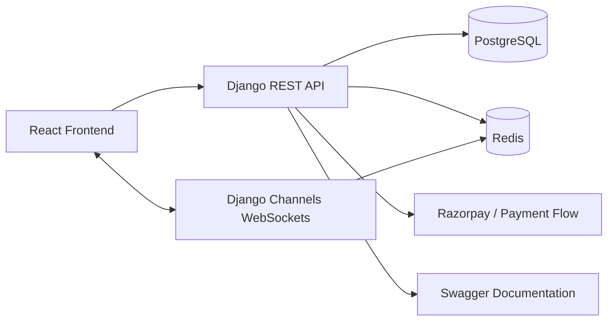

# Sahāy Project Report

## 1. Problem Statement

Local service marketplaces often fail to provide a secure, role-aware, and reliable workflow for customers, providers, and platform operators. Sahāy addresses this by offering a SaaS-style platform where users can discover services, create bookings, pay securely, communicate anonymously, and receive realtime updates while administrators and support agents manage operations and disputes.

## 2. Objectives

- Build a multi-role marketplace with clean separation of concerns.
- Implement JWT-based authentication and role-based access control.
- Support service discovery, booking, payment, chat, and notifications.
- Provide dedicated dashboards for customer, provider, admin, and support users.
- Ensure the application is professionally structured and production-ready.

## 3. System Architecture

Sahāy uses a modular full-stack architecture.

### Backend Layers

- `models`: store domain data such as users, services, bookings, payments, chat rooms, notifications, and support tickets.
- `serializers`: validate and format input/output payloads.
- `views`: implement API endpoints and business workflows.
- `permissions`: enforce role-based access rules.
- `services`: contain reusable business logic such as notification creation.
- `utils`: hold shared helpers like commission calculation and masking logic.

### Frontend Layers

- `components`: reusable UI elements and layout primitives.
- `pages`: route-level screens for customer, provider, admin, support, auth, and notifications.
- `services`: API clients and websocket helpers.
- `store`: Zustand state management for auth, bookings, chat, notifications, and UI state.
- `utils`: shared constants and route helpers.
- `types`: TypeScript interfaces for structured data.

## 4. Database Schema Explanation

### Accounts

- `User`: custom auth model with email login, phone number, and role enum.
- `ProviderProfile`: provider-specific verification, rating, service area, and city details.

### Services

- `Category`: groups services into business-friendly collections.
- `Service`: provider offerings with price, description, and category data.

### Bookings

- `Booking`: captures customer, provider, service, scheduling, address, payment method, pricing, and lifecycle state.
- Booking status lifecycle includes `PENDING`, `CONFIRMED`, `ACCEPTED`, `IN_PROGRESS`, `COMPLETED`, `CANCELLED`, `REFUNDED`, and `DISPUTED`.

### Payments

- `Payment`: stores order, transaction, status, and escrow-related payment fields.
- `Wallet`: tracks provider balances.
- `WalletTransaction`: records ledger entries such as escrow release.

### Chat

- `ChatRoom`: created per booking for private discussion.
- `Message`: stores chat content, sender, and moderation flags.

### Notifications

- `Notification`: stores realtime and persistent user alerts with type and payload data.

### Support and Admin

- `SupportTicket`: captures customer support requests, related booking data, and status.
- Admin moderation views expose provider approvals and flagged chat messages.

## 5. Security Implementation

### Authentication

- JWT authentication is used for API access.
- Refresh token blacklisting is enabled.
- WebSocket connections are authenticated with JWT middleware.

### Authorization

- Role-based permissions protect endpoint access.
- Frontend route guards prevent direct navigation to restricted dashboards.
- Support and admin surfaces are separated from customer and provider workflows.

### Privacy and Safety

- Sensitive booking contact details are masked in public contexts.
- Chat messages are scanned with regex patterns to block phone-number sharing.
- Unauthorized booking status updates are rejected.

### Operational Safety

- Environment variables are used for secrets and deployment configuration.
- CORS defaults are restricted instead of allowing all origins.
- API throttling is enabled through Django REST Framework defaults.

## 6. Functional Workflow Summary

### Customer Flow

1. Register and log in using JWT.
2. Browse and filter services.
3. Create a booking with preferred date, time, address, and payment method.
4. Pay using Razorpay test mode or cash.
5. Chat anonymously with the provider.
6. Receive notifications about booking status changes.

### Provider Flow

1. Log in and view the provider dashboard.
2. Review assigned bookings and earnings.
3. Update profile and availability-related details.
4. Receive booking and payment notifications.

### Support Flow

1. Review support tickets.
2. Track unresolved customer issues.
3. Escalate or close cases.

### Admin Flow

1. Monitor platform analytics.
2. Review provider approvals.
3. Inspect flagged chats and moderation data.

## 7. UI/UX Design Notes

- The UI is card-based, clean, and responsive.
- Loading indicators and empty states are used to avoid blank screens.
- Navigation and dashboards are role-aware.
- The booking form and service browsing screens are designed for mobile and desktop use.
- Notification and chat affordances are accessible from the layout shell.

## 8. Challenges Faced

- Keeping backend permissions, frontend routing, and dashboard UX aligned across four roles.
- Preserving privacy in chat and booking views while still enabling useful communication.
- Coordinating realtime chat, notifications, and booking state transitions without brittle coupling.
- Maintaining a modular structure while expanding the app into a SaaS-style product.

## 9. Validation Summary

The project was validated against the following practical expectations:

- JWT authentication works end to end.
- Service search and booking flows are operational.
- Payment workflow supports Razorpay test mode semantics.
- Commission calculation follows the 10% rule.
- Chat blocks phone-number sharing.
- Role-based dashboards and route protection are in place.
- Realtime notifications are supported.
- Documentation now includes setup, environment variables, and architecture details.

## 10. Future Scope

- Add ticket assignment and SLA tracking for support agents.
- Expand analytics dashboards with charts and filters.
- Add automated testing for API, component, and workflow validation.
- Introduce deployment-ready container orchestration files.
- Add audit logs for critical admin actions.
- Improve production observability with structured logging and tracing.

## 11. Conclusion

Sahāy demonstrates a modern SaaS marketplace architecture with clean separation of concerns, secure authentication, role-based access control, realtime communication, and professional UI patterns. The codebase is structured to satisfy academic evaluation criteria while still resembling a production application.
