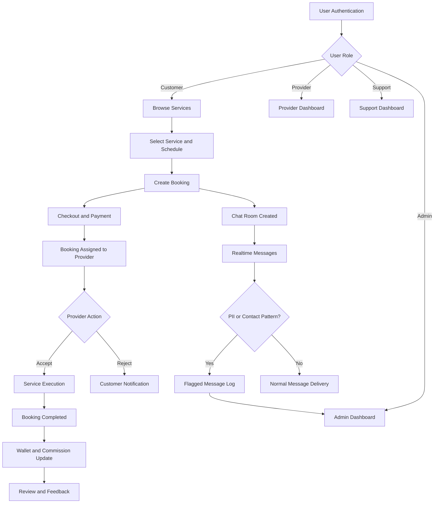

# Midterm Review Report

## TITLE
Sahay: Role-Based Full-Stack Marketplace Platform for Local Services

## Submitted by
Name: [Enter Your Name]

Register Number: [Enter Your Register Number]

## Under the Guidance of
Dr Setturu Bharath

Dr Hariprasad M (MSc)

Course: Master of Computer Applications (M.C.A) / Master of Science (MSc - Data Science)

Academic Component: Core Project (Second Semester) - Midterm Review Submission

Academic Year: 2025 - 2026

School: School of Engineering / School of Mathematics and Natural Sciences (for MSc DS)

---

## Contents
1. Tables
2. Images
3. Details of the Company with URLs and Other Information
4. Introduction
5. Literature Review
6. Objectives of the Study / Expected Outcome
7. Method (Flow Chart, Tools Used, Dataset Description)
8. Results and Discussion (Work Progress)
9. Challenges Faced
10. Data Sources
11. References

---

## 1. Tables

### Table 1.1: Technology Stack
| Layer | Technologies Used | Remarks |
|---|---|---|
| Frontend | React 19, TypeScript, Vite, Tailwind CSS, Zustand, Axios, React Router, Recharts | Role-aware SPA and API-driven UI |
| Backend | Python, Django, Django REST Framework, SimpleJWT, Django Channels | Modular monolith with REST + WebSocket |
| Database and Cache | PostgreSQL, Redis | Transactional persistence + realtime channel backing |
| API and Docs | REST APIs, drf-yasg Swagger | Self-documented API contracts |
| Deployment | Docker, Gunicorn, Uvicorn Worker, Render | ASGI-ready cloud deployment pattern |

### Table 1.2: User Roles and Responsibilities
| Role | Responsibilities | Permission Scope |
|---|---|---|
| Customer | Uses Customer Dashboard (`/customer/dashboard`) to discover services, place bookings, complete payment, chat with provider, and submit reviews | Customer-owned data and actions |
| Provider | Uses Provider Dashboard (`/provider/dashboard`) to manage services, accept/reject bookings, update availability, and track earnings and wallet | Provider-owned services and bookings |
| Support Agent | Handle support tickets, resolve/escalate customer and provider issues | Ticket and support domain |
| Admin | Monitor analytics, approve/reject providers, review flagged chats, supervise operations | Full governance and moderation scope |

### Table 1.3: Core Backend Modules
| Module | Purpose | Key Entities |
|---|---|---|
| accounts | User registration, login, profile and role management | User, ProviderProfile |
| services | Category and service catalog, provider-owned service management | Category, Service |
| bookings | Booking creation, scheduling and lifecycle states | Booking |
| payments | Payment lifecycle, commission accounting, wallet and transactions | Payment, ProviderWallet, WalletTransaction |
| chat | Booking-scoped messaging with moderation support | ChatRoom, Message, FlaggedMessageLog |
| notifications | In-app and realtime notifications | Notification |
| reviews | Rating and feedback system | Review |
| support | Support ticket workflow | SupportTicket |
| adminpanel | Governance dashboards and moderation actions | Revenue analytics, provider verification actions |

### Table 1.4: Booking and Payment State Model (Implemented)
| Domain | States | Operational Purpose |
|---|---|---|
| Booking | PENDING_PAYMENT, PENDING, REJECTED, CONFIRMED, ACCEPTED, IN_PROGRESS, COMPLETED, CANCELLED, REFUNDED, DISPUTED | End-to-end service fulfillment and dispute tracing |
| Payment | INITIATED, PAID, RELEASED, FAILED, REFUNDED | Financial auditability and settlement tracking |

### Table 1.5: Non-Functional Requirements Coverage
| Requirement | Current Status | Evidence |
|---|---|---|
| Security | Implemented | JWT, role permissions, CORS, host restrictions, throttling |
| Reliability | Implemented with scope for expansion | Validation checks, graceful API handling, fallback logic |
| Scalability | Foundation implemented | PostgreSQL, Redis, Channels, modular app boundaries |
| Maintainability | Implemented | Domain-wise app separation, service/store layers |
| Observability | Partial | Structured error responses and admin analytics; advanced tracing pending |

---

## 2. Images

The following screenshots should be inserted in the final submitted PDF or printed report. Use clear captions and figure numbering.

1. Figure 2.1: Landing page with category and service discovery blocks.
2. Figure 2.2: Service listing with search/filter controls.
3. Figure 2.3: Service detail page showing pricing, duration, and provider context.
4. Figure 2.4: Checkout flow with address selection and order summary.
5. Figure 2.5: Payment flow and payment success confirmation.
6. Figure 2.6: Customer Dashboard (`/customer/dashboard`) with booking status timeline.
7. Figure 2.7: Customer chat interface for booking-linked communication.
8. Figure 2.8: Provider Dashboard (`/provider/dashboard`) with metrics and action cards.
9. Figure 2.9: Provider services page with create/update/activate/deactivate/delete actions.
10. Figure 2.10: Provider earnings page with wallet summary and transaction list.
11. Figure 2.11: Provider availability configuration page.
12. Figure 2.12: Support dashboard with ticket queue and status transitions.
13. Figure 2.13: Admin dashboard with revenue and moderation overview.
14. Figure 2.14: Admin flagged chats review page.
15. Figure 2.15: Swagger API documentation page.

---

## 3. Details of the Company with URLs and Other Information

### 3.1 Project Identity
Project Name: Sahay

Project Type: Full-Stack SaaS Marketplace Prototype

Domain: On-demand Local Services Platform

Target Users:
1. Service customers who require trusted local professional support.
2. Service providers seeking digital lead generation and booking management.
3. Support and admin stakeholders responsible for governance.

### 3.2 Problem Context and Motivation
Local services in many regions are coordinated through fragmented channels (calls, direct messages, untracked referrals), leading to:

1. Weak trust and no consistent provider verification process.
2. Unstructured booking and schedule collisions.
3. Opaque pricing and non-auditable commission handling.
4. Poor issue resolution due to missing ticket workflows.
5. Privacy risks from contact sharing outside controlled channels.

Sahay addresses these gaps through a role-based, transaction-oriented platform with traceable workflow states and moderation controls.

### 3.3 Vision and Value Proposition
Sahay aims to become a reliable digital intermediary between service demand and service supply by combining:

1. Discoverability and booking convenience for customers.
2. Operational dashboarding for providers.
3. Governance and trust frameworks for platform operators.
4. Clear state transitions for fulfillment and financial operations.

### 3.4 URLs and Access Information
Local Frontend URL: http://127.0.0.1:5173

Local Backend URL: http://127.0.0.1:8000

API Documentation (Swagger): http://127.0.0.1:8000/api/docs/

Repository Root Documentation: [README.md](README.md)

Project Report Document: [PROJECT_REPORT.md](PROJECT_REPORT.md)

### 3.5 Implemented Business Features
1. Multi-role authentication and authorization.
2. Public service discovery with category/search filtering.
3. Structured booking lifecycle from request to completion.
4. Checkout and payment integration flows.
5. Provider service management and availability controls.
6. Wallet and commission-aware earnings accounting.
7. Realtime chat and notification delivery.
8. Moderation and governance workflows for support and admin.

---

## 4. Introduction

Sahay is a role-based full-stack marketplace engineered to digitalize local service transactions. The platform includes the full cycle from service discovery and booking to payment settlement, communication, and post-service review. It is designed as a practical core project to demonstrate how modern web architecture can solve real-world coordination and trust problems in local service ecosystems.

The system is built as a modular backend with an API-first integration strategy and a role-protected frontend. Domain apps in the backend separate core business concerns such as accounts, services, bookings, payments, reviews, chat, notifications, support, and administration. This separation improves maintainability, testing boundaries, and future feature expansion.

The frontend provides dedicated user experiences for customer, provider, support, and admin personas. The provider side in particular was improved to remove dummy placeholders and run fully on live APIs, making operational views consistent with real backend data.

The report captures technical specifications, architecture rationale, implemented outcomes, challenges, and future directions in the same format required for the academic midterm review.

---

## 5. Literature Review

The solution and architecture align with widely accepted patterns in marketplace and SaaS engineering.

### 5.1 Role-Based Access Control (RBAC)
RBAC is a primary security and design requirement in multi-actor systems. It reduces unauthorized data access, supports policy enforcement, and simplifies responsibility boundaries.

### 5.2 JWT-Based Stateless Authentication
Stateless token-based authentication is standard for decoupled web apps. It supports horizontal API scaling and clean separation between frontend and backend identity handling.

### 5.3 Domain-Driven Transaction Modeling
Marketplaces depend on explicit workflow states. Modeling booking and payment status transitions enables traceability, rollback logic, support interventions, and financial reconciliation.

### 5.4 Realtime Communication Architecture
WebSockets are preferred for chat and live notifications because they reduce polling overhead and improve user responsiveness in transaction-sensitive workflows.

### 5.5 Trust, Safety, and Moderation
Modern marketplace systems need policy controls for abuse prevention and compliance. Flagging suspicious messages and exposing moderation views to administrators increases trust and accountability.

### 5.6 Financial Integrity in Platform Economics
Commission and payout accounting must be explicit and auditable. Wallet-ledger patterns provide transparent mapping between booking outcomes and provider settlements.

### 5.7 API-First Frontend Integration
Clean service clients and normalized response handling improve resilience during API evolution, reducing tight coupling between UI components and backend payload variations.

---

## 6. Objectives of the Study / Expected Outcome

### 6.1 Primary Objectives
1. Build a robust full-stack local-services marketplace.
2. Implement secure authentication with role-aware authorization.
3. Deliver complete customer journey from browsing to service completion.
4. Provide an operational control panel for providers.
5. Introduce governance and support workflows for platform operations.
6. Enable realtime interactions and notification delivery.
7. Establish a deployable architecture with production-aware configuration.

### 6.2 Technical Objectives
1. Define modular backend domain boundaries.
2. Implement REST APIs with serializer and permission controls.
3. Integrate frontend store/service abstractions with centralized error handling.
4. Use PostgreSQL for transactional consistency and Redis for realtime transport.
5. Provide API documentation and reproducible local setup.

### 6.3 Expected Outcomes
1. A functionally integrated role-based SaaS platform prototype.
2. Reliable backend APIs and frontend integration for core domain operations.
3. Improved process standardization over informal local-service coordination.
4. A scalable foundation for production hardening and future expansion.

---

## 7. Method (Flow Chart, Tools Used, Dataset Description)

### 7.1 Development Methodology
An iterative module-by-module approach was followed:

1. Foundation setup: authentication, user roles, route protection.
2. Domain modeling: services, bookings, payments, reviews, notifications.
3. API-first implementation with serializers and permission boundaries.
4. Frontend integration through stores, service clients, and role dashboards.
5. Realtime enablement via WebSocket channels.
6. Governance and moderation capability integration.
7. Regression fixes and migration of legacy provider UI to live APIs.

### 7.2 System Workflow Flow Chart

### 7.3 Tools Used

Programming Languages:
1. Python
2. TypeScript
3. JavaScript

Backend Frameworks and Libraries:
1. Django
2. Django REST Framework
3. SimpleJWT
4. Django Channels
5. django-filter
6. drf-yasg

Frontend Frameworks and Libraries:
1. React
2. Vite
3. Zustand
4. Axios
5. Tailwind CSS
6. React Router

Infrastructure and DevOps Tools:
1. PostgreSQL
2. Redis
3. Docker and docker-compose
4. Gunicorn and Uvicorn worker
5. Render deployment configuration
6. Git and GitHub

### 7.4 Dataset Description
This project does not use a static external machine-learning dataset. The platform is transaction-driven and generates operational data from live workflows:

1. User registration and profile metadata.
2. Provider profile and verification data.
3. Category and service catalog records.
4. Booking records with schedule and status transitions.
5. Payment, commission, and wallet transaction records.
6. Chat messages and flagged moderation logs.
7. Notification events and read-state data.
8. Support ticket records.
9. Customer review and rating records.

### 7.5 API Surface Summary (Implemented)
1. Authentication endpoints for registration, login, token refresh, and profile.
2. Public service endpoints for categories, service listing, and service details.
3. Provider-specific service CRUD endpoints.
4. Booking endpoints for create/list/state transitions.
5. Payment endpoints for create intent/order, verify, history, wallet, and refund.
6. Review endpoints for create/list operations.
7. Notification endpoints and websocket streams.
8. Support ticket endpoints.
9. Admin endpoints for analytics and moderation.

---

## 8. Results and Discussion (Work Progress)

### 8.1 Functional Results Achieved
1. Role-based login and protected navigation implemented.
2. Customer service browsing and booking workflow completed.
3. Checkout and payment integration pathways operational.
4. Provider workspace fully connected to live APIs for services and operations.
5. Provider availability, earnings, and transaction visibility implemented.
6. Realtime chat and notifications integrated using websocket architecture.
7. Admin analytics and moderation screens implemented.
8. Support ticket dashboard and status handling implemented.
9. Public service visibility corrected for legacy and provider-owned data paths.

### 8.2 Key Engineering Improvements Completed
1. Provider services now support create, update, delete, and active/inactive toggling.
2. Legacy provider pages were migrated from mock placeholders to API-backed data.
3. Error normalization and token handling improved in frontend API client layer.
4. Compatibility normalization was added to preserve UI stability across payload variants.
5. Availability management endpoint and provider review integrations were aligned.

### 8.3 Architecture and Quality Outcomes
1. Backend organized into modular apps with clear separation of concerns.
2. Frontend organized with service and store abstraction for maintainable growth.
3. Role separation enforced at route-level and API permission-level.
4. Message-level moderation controls implemented to support trust and governance.
5. Build and runtime workflows support local reproducibility and deployment readiness.

### 8.4 Discussion and Impact Analysis
The project has reached a strong midterm maturity level. Core marketplace capabilities are integrated end-to-end and suitable for demonstration in an academic review. The implemented structure reflects practical software engineering choices: domain modularity, API-first integration, role-based security, realtime communication, and auditable payment lifecycle.

The transition from dummy provider data to live API-backed screens significantly improved system authenticity and operational reliability. This also reduced UI-logic duplication and improved maintainability for future enhancements.

### 8.5 Remaining Scope Toward Final Submission
1. Expand automated test coverage across critical booking and payment transitions.
2. Add deeper observability (structured logs, metrics dashboards, alerting).
3. Introduce stronger CI pipelines and release controls.
4. Refine UX polish and accessibility audits for production readiness.
5. Document full API contract matrix and error code taxonomy.

---

## 9. Challenges Faced

1. Synchronizing frontend expectations with evolving backend API contracts.
2. Migrating legacy provider pages from static/mock data to live backend responses.
3. Handling legacy database conditions in public service visibility filters.
4. Maintaining strict role isolation while preserving smooth user journeys.
5. Coordinating websocket token handling and reconnect logic.
6. Ensuring robustness during iterative development without regression drift.
7. Aligning multiple stakeholder requirements (customer flow, provider operations, governance).

### 9.1 Mitigation Strategies Applied
1. Introduced API response normalization and compatibility methods.
2. Added provider/public endpoint separation with clear ownership boundaries.
3. Applied targeted filtering fixes for legacy data behavior.
4. Used route-level and permission-level role enforcement.
5. Validated build and backend checks after major change sets.

---

## 10. Data Sources

Primary data and documentation sources:

1. Repository-level documentation: [README.md](README.md)
2. Project report source: [PROJECT_REPORT.md](PROJECT_REPORT.md)
3. Backend API documentation: http://127.0.0.1:8000/api/docs/
4. Backend architecture and implementation files:
   - [backend/config/urls.py](backend/config/urls.py)
   - [backend/config/settings.py](backend/config/settings.py)
   - [backend/config/asgi.py](backend/config/asgi.py)
   - [backend/accounts/models.py](backend/accounts/models.py)
   - [backend/services/models.py](backend/services/models.py)
   - [backend/bookings/models.py](backend/bookings/models.py)
   - [backend/payments/models.py](backend/payments/models.py)
   - [backend/chat/models.py](backend/chat/models.py)
   - [backend/notifications/models.py](backend/notifications/models.py)
   - [backend/reviews/models.py](backend/reviews/models.py)
   - [backend/support/models.py](backend/support/models.py)
   - [backend/adminpanel/views.py](backend/adminpanel/views.py)
5. Frontend architecture and implementation files:
   - [frontend/src/App.tsx](frontend/src/App.tsx)
   - [frontend/src/services/api.ts](frontend/src/services/api.ts)
   - [frontend/src/services/providerServiceApi.ts](frontend/src/services/providerServiceApi.ts)
   - [frontend/src/services/serviceService.ts](frontend/src/services/serviceService.ts)
   - [frontend/src/store/notificationStore.ts](frontend/src/store/notificationStore.ts)
6. Framework and technology documentation:
   - Django Documentation: https://docs.djangoproject.com/
   - Django REST Framework Documentation: https://www.django-rest-framework.org/
   - React Documentation: https://react.dev/
   - Vite Documentation: https://vite.dev/
   - Redis Documentation: https://redis.io/docs/
   - PostgreSQL Documentation: https://www.postgresql.org/docs/

---

## 11. References

[1] Django Software Foundation. Django Documentation. https://docs.djangoproject.com/

[2] Encode OSS Ltd. Django REST Framework Documentation. https://www.django-rest-framework.org/

[3] React Team. React Documentation. https://react.dev/

[4] Vite Team. Vite Documentation. https://vite.dev/

[5] PostgreSQL Global Development Group. PostgreSQL Documentation. https://www.postgresql.org/docs/

[6] Redis Ltd. Redis Documentation. https://redis.io/docs/

[7] JWT. Introduction to JSON Web Tokens. https://jwt.io/introduction

[8] Django Channels Documentation. https://channels.readthedocs.io/

[9] Gunicorn Documentation. https://docs.gunicorn.org/

[10] Render Documentation. https://render.com/docs

---

## Annexure A: Codebase Evidence Summary

Important implementation references in this project include:

1. Backend route map: [backend/config/urls.py](backend/config/urls.py)
2. Runtime and security settings: [backend/config/settings.py](backend/config/settings.py)
3. Realtime websocket ASGI router: [backend/config/asgi.py](backend/config/asgi.py)
4. Frontend route protection and role dashboards: [frontend/src/App.tsx](frontend/src/App.tsx)
5. Domain models:
   - [backend/accounts/models.py](backend/accounts/models.py)
   - [backend/services/models.py](backend/services/models.py)
   - [backend/bookings/models.py](backend/bookings/models.py)
   - [backend/payments/models.py](backend/payments/models.py)
   - [backend/chat/models.py](backend/chat/models.py)
   - [backend/reviews/models.py](backend/reviews/models.py)
   - [backend/notifications/models.py](backend/notifications/models.py)
   - [backend/support/models.py](backend/support/models.py)
6. Governance and analytics views: [backend/adminpanel/views.py](backend/adminpanel/views.py)
7. Deployment configuration:
   - [backend/Dockerfile](backend/Dockerfile)
   - [backend/docker-compose.yml](backend/docker-compose.yml)
   - [render.yaml](render.yaml)

## Annexure B: Suggested Final Viva Points

1. Why role-based architecture was mandatory for this product category.
2. How booking and payment state machines guarantee traceability.
3. Why websocket transport was selected for chat and notifications.
4. How moderation controls are implemented at the message layer.
5. How provider UI migration from mock data to live APIs improved system quality.
6. What production hardening steps are planned for final phase.

